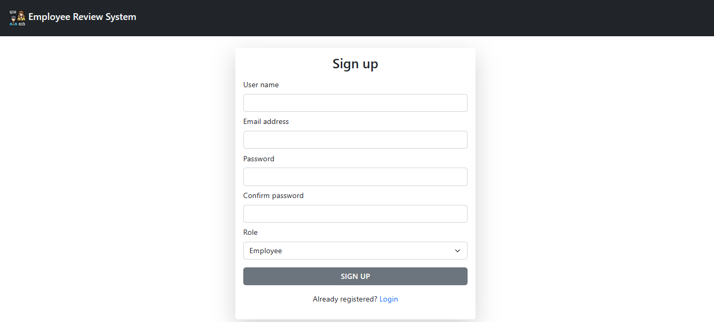

# Employee review system

This project aims to create an Employee Review System where employees can submit feedback on each other's performance. The system consists of both admin and employee views, allowing for management of employees, performance reviews, and feedback submission.
It is built using NodeJs, ExpressJs, MongoDB, EJS and JavaScript.

## Features

### Admin View

- Add/remove/update/view employees
- Add/update/view performance reviews
- Assign employees to participate in another employee's performance review

### Employee View

- List of performance reviews requiring feedback
- Submit feedback

## Getting started

- Clone the repository to your local machine.
- Navigate to the project directory.
- Install dependencies using npm install.
- Start the development server with npm start.
- Install all required packages
- Access the application through the provided URL.

The project is running on the port number provided by you.

## Tools Used

- NodeJS
- MongoDB
- ExpressJS
- EJS
- Bootstrap

### Libraries:

- bcryptjs
- connect-flash
- connect-mongo
- cookie-parser
- dotenv
- ejs
- express
- express-ejs-layout
- express-session
- mongoose
- passport
- passport-jwt
- passport-local

## Screenshots

